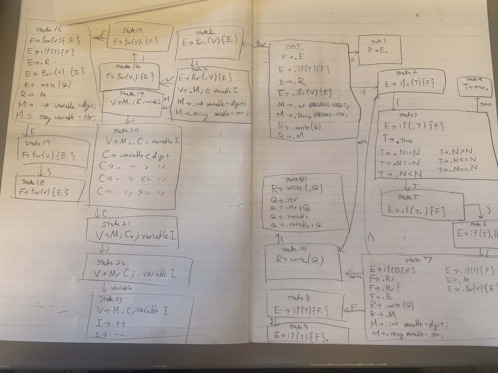

# Context-Free Grammar Specification


Write the description of your context-free grammar here.
*This grammar defines Java basic operation such as assignment of numbers and string, if and for and System.out.println statement and true.*


## Formal Definition

The grammar G is a 4-tuple (V, Σ, R, S):

### V (Variables/Non-terminals):

Write the Non-terminals set here.

`V = {E, T, F, N, V, M, R, Q, C, I}`

### Σ (Terminals):

Write the Terminals set here.
`Σ ={+, -, *, /, (, ), {, }, %, =, <, >, ;, #, WRITE, IF, FOR, TRUE, INT, STRING, VARIABLE, DIGIT, STR}`

### S (Start Symbol):

Write the Start Symbol here.

`S = {E}`

### R (Production Rules):

```ebnf
E --> IF(T){F} 
E --> R
E --> FOR(V){F}
T --> TRUE
T --> N==N | N!=N | N<N | N<=N | N>N | N>=N
N --> VARIABLE | DIGIT | N+N | N-N | N*N | N/N | N%N
F --> R; | R;F | E
R --> WRITE(Q) | M
Q --> STR | STR+Q | VARIABLE | VARIABLE+Q
M --> INT VARIABLE = DIGIT; | STRING VARIABLE = STR;
V --> M;C;VARIABLE I
I --> ++ | --
C --> VARIABLE<DIGIT | VARIABLE<=DIGIT | VARIABLE>DIGIT | VARIABLE>=DIGIT | VARIABLE<VARIABLE | VARIABLE<=VARIABLE | VARIABLE>VARIABLE | VARIABLE>=VARIABLE
```


## LR(1) Automaton


Draw the LR(1) automaton for your grammar

*It was too big to write down whole automaton...*


## LALR Verification

### Item Sets: 

List the states that can be merged


### Parse Table and Conflict Check

Draw the LALR Parse Table and check if there are any shift-reduce conflict. Write down if you found or not any shift-reduce conflict.


### LALR Automaton

Re-draw the LR(1) automaton after merging states


